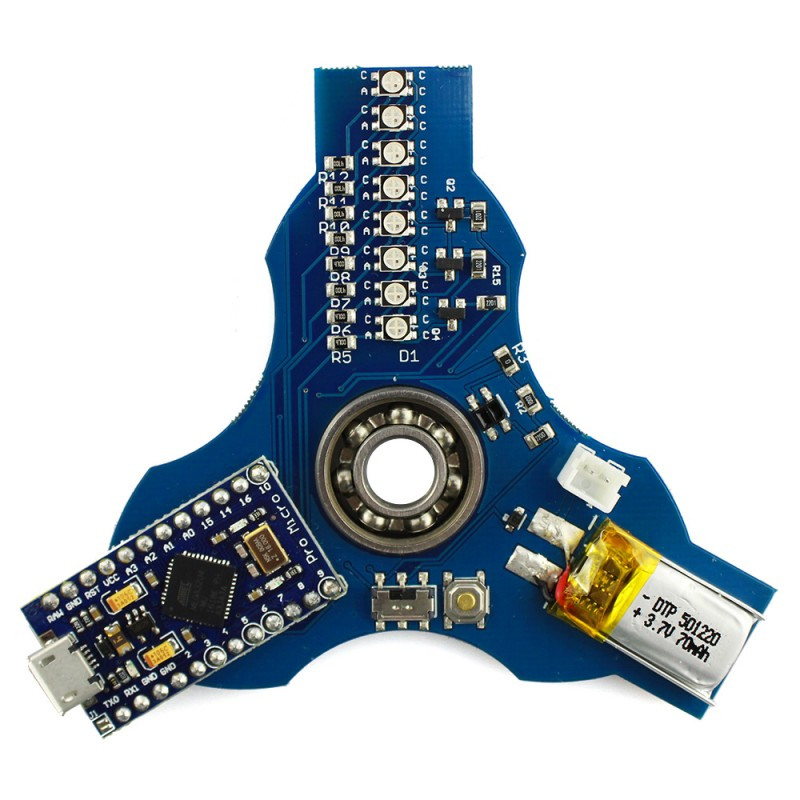

# Lightino STEAM Fidget Spinner

## Getting Started

1. Ensure you're using the latest Arduino IDE
1. Select 'Arduino / Genuino Micro' from the Board menu under Tools
1. Select the correct 'com port' for your device

### Common Errors

#### TXLED0 is not defined

You need to ensure that the Arduino/Genuino Micro is selected as the board type. These boards have some pre-defined variables which are used in the example sketches in this project.

## More information

For more details, check out the product page at

http://makerstorage.com/index.php?id_product=29&controller=product

MakerStorage invests time and resources providing this open source design, please support MakerStorage and open-source hardware by purchasing products from MakerStorage!

Designed by MakerStorage LLC.

Creative Commons Attribution, Share-Alike license, check https://creativecommons.org/licenses/by-sa/3.0/ for more information All text above must be included in any redistribution

I am thinking for a while about how to teach young generation coding funnily. We all know it is essential to learn how to code, but it is not so easy. It takes time, and most of the young learners give up and fail at the beginning. You need something interesting to continue and try many times even you fail one after the other. It requires more time and practice than you might expect, so you need a feedback mechanism that motivates you on trying without giving up. It is an absolute truth that Fidget Spinners finds its way into the hearts of young people. I decided to use this popularity and create a fidget spinner with RGB LEDs and Arduino. It was a combination of two things that I love the most.

Our Blog for code sharing: https://lightino.org/

